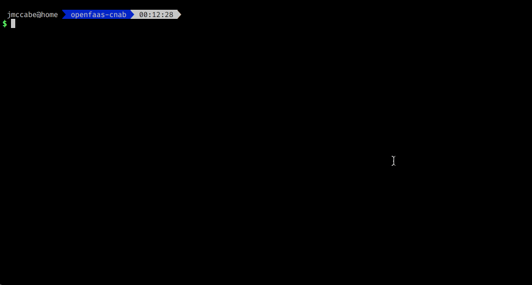

# OpenFaaS CNAB Duffle Packaging

This repo packages up OpenFaaS for Docker Swarm as a [CNAB Bundle](https://github.com/deislabs/cnab-spec/) using the [duffle](https://github.com/deislabs/duffle) CNAB installer.

- https://open.microsoft.com/2018/12/04/announcing-cnab-cloud-agnostic-format-packaging-running-distributed-applications/
- https://techcrunch.com/2018/12/04/microsoft-and-docker-team-up-to-make-packaging-and-running-cloud-native-applications-easier/

As I don't yet have access to a public CNAB repo to publish the bundle to you will have to build locally - I'll update as soon as one becomes available (this repo may also subsequently move under the [openfaas-incubator](https://github.com/openfaas-incubator) org)

Also it sounds like it should be possible to target multiple orchestrators with a single bundle, should that prove possible I'll merge the Kubernetes install here as well.

I think CNAB has lots of potential !! A few rough edges right now but its very new and has the backing of both [Docker](https://github.com/docker) and [Microsoft](https://github.com/microsoft) with some of the core [Helm](https://github.com/helm) contributors heavily involved.

## Prerequisites

- Install Duffle as described in their [repo](https://github.com/deislabs/duffle).
- Docker running in Swarm mode.

## Building the CNAB Bundle

- Clone this repo and `cd` into it.

      git clone https://github.com/johnmccabe/openfaas-cnab.git`
      cd openfaas-cnab

- Build the CNAB bundle with `duffle`

      duffle build

## Installing OpenFaaS from CNAB Bundle

- Create Basic Auth credentials used to secure the API/UI (note that other mechanisms for securing OpenFaaS exist, I'm just including the basic option at the moment).

      duffle creds generate dev-creds johnmccabe/openfaas:0.9.7

- Install OpenFaaS (you can optionally disable auth by passing `--set basic_auth=false` to `duffle install`)

      duffle install openfaas johnmccabe/openfaas:0.9.7 -c dev-creds

- View the installed app and check the status of OpenFaaS

      duffle list
      duffle status openfaas -c dev-creds

- You can now proceed to login and use OpenFaaS (see the [docs](https://docs.openfaas.com) for guidance)

      faas login
      faas store deploy figlet
      echo HelloWorld | faas invoke figlet
